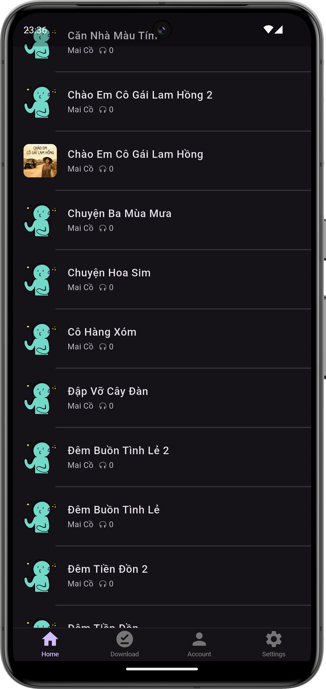
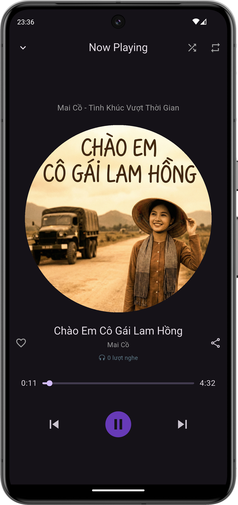
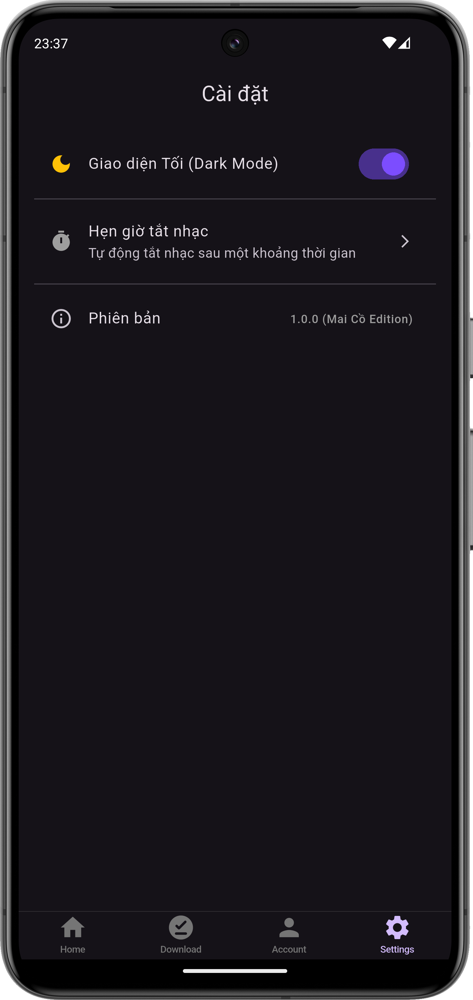

# 🎵 MichaelMusic — Ứng dụng Nghe Nhạc Flutter

MichaelMusic là ứng dụng nghe nhạc được xây dựng bằng Flutter, tập trung vào trải nghiệm mượt mà, hỗ trợ phát nhạc Online/Offline, chạy nền và nhiều tiện ích thông minh. README này cung cấp thông tin đầy đủ và chi tiết để bất kỳ ai cũng có thể hiểu, build và chạy ứng dụng.


---

## 📸 Demo Giao Diện

|                         Home                         |                         Player                         |                         Settings                         |
| :--------------------------------------------------: | :----------------------------------------------------: | :------------------------------------------------------: |
|  |  |  |

> Đặt ảnh trong đường dẫn `assets/screenshots/` để hiển thị.

---

## ✨ Tính năng nổi bật

### 🎧 Trình phát nhạc

* Play / Pause / Next / Previous
* Seekbar hiển thị thời gian và buffer
* Chế độ phát: Shuffle, Repeat All, Repeat One
* Hiệu ứng giao diện: Hero Animation, đĩa nhạc xoay

### 💾 Chế độ Offline (Smart Cache)

* Tự động tải MP3 và ảnh bìa khi phát Online
* Lần sau ưu tiên phát từ bộ nhớ máy
* Có tab quản lý bài hát tải xuống

### 📻 Phát nền (Background Playback)

* Tích hợp audio_service
* Điều khiển nhạc từ thanh thông báo và màn hình khóa

### ⏱️ Tiện ích mở rộng

* Hẹn giờ tắt nhạc
* Mini Player
* Yêu thích bài hát
* Dark Mode

---

## 🛠️ Công nghệ sử dụng

| Thư viện                 | Mục đích                  |
| ------------------------ | ------------------------- |
| flutter                  | Framework chính           |
| just_audio               | Phát âm thanh và playlist |
| audio_service            | Chạy nền + thông báo      |
| audio_session            | Quản lý phiên âm thanh    |
| dio                      | Download bài hát, ảnh     |
| path_provider            | Truy cập thư mục hệ thống |
| rxdart                   | Quản lý Stream & state    |
| permission_handler       | Quyền truy cập bộ nhớ     |
| audio_video_progress_bar | Seekbar tùy biến          |

---

## 📂 Cấu trúc dự án

```text
lib/
├── data/
│   ├── model/             # Song model
│   ├── repository/        # Repository pattern
│   └── service/           # FileManager: download, cache
├── ui/
│   ├── home/
│   │   ├── home.dart
│   │   ├── tab_download.dart
│   │   ├── song_list_view.dart
│   │   └── mini_player.dart
│   ├── now_playing/
│   │   ├── audio_player_manager.dart    # Singleton player logic
│   │   ├── audio_handler.dart           # AudioService config
│   │   └── widgets/
│   └── settings/
│       ├── settings.dart
│       └── theme_manager.dart
└── main.dart
```

---

## 🚀 Cách cài đặt & chạy ứng dụng

### 1. Chuẩn bị môi trường

* Flutter SDK >= 3.3.0
* Java JDK 11 hoặc 17
* Android Studio hoặc VS Code

### 2. Clone dự án

```bash
git clone https://github.com/majinbuu2k4/michaelmusic.git
cd michaelmusic
```

### 3. Cài đặt thư viện

```bash
flutter pub get
```

### 4. Quyền Android

Ứng dụng đã có sẵn các quyền trong AndroidManifest.xml:

* INTERNET
* WAKE_LOCK, FOREGROUND_SERVICE
* READ_MEDIA_AUDIO (Android 13+)
* READ/WRITE_EXTERNAL_STORAGE (Android cũ)

### 5. Cấu hình dữ liệu nhạc

* File dữ liệu: `assets/michaelsongs.json`
* Cập nhật lại URL nhạc nếu link cũ hết hạn (đặc biệt nếu dùng Ngrok)

### 6. Chạy ứng dụng

```bash
flutter run
```

---

## 🐛 Khắc phục lỗi phổ biến

### ❗ Không phát được nhạc (Dio error)

* Kiểm tra URL trong JSON
* Kiểm tra kết nối mạng
* Link Ngrok có thể hết hạn, cần cập nhật lại

### ❗ Android 13 không cấp quyền

* Cần READ_MEDIA_AUDIO
* Dùng permission_handler để xin quyền

### ❗ Lỗi xung đột phiên bản Gradle/Kotlin

* Dự án dùng Gradle 8.x và Kotlin 1.9+ → Cần SDK cập nhật

---

## 🤝 Đóng góp

1. Fork repo
2. Tạo branch mới: `feature/my-feature`
3. Commit và push
4. Tạo Pull Request

---

## 📝 Tác giả

**Mai Cồ (Van Phuc)**

Ứng dụng được phát triển với đam mê âm nhạc và Flutter.
